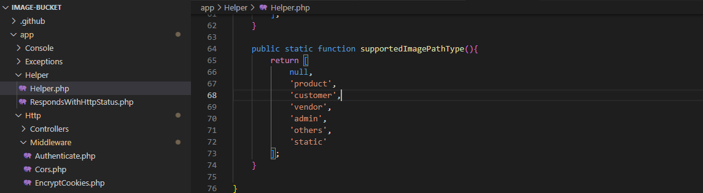

## Image Bucket Service

Image Bucket Service is a service that provides object storage through a web service interface. Image Bucket uses the same scalable storage infrastructure. Image Bucket can store Only Image type of object, which allows uses like storage for Internet applications. 

## Documentation

## Uploader Image
    - only Four type of image extention are allow, If you are use other extention, go to App\Helper\Helper.php and Edit supportImageExtention() funtion and add your extention.
    

    - If your image store are different directory, go to App\Helper\Helper.php and Edit supportedImagePathType() and add your directory path. 
    

## uploading 
    - http://127.0.0.1:8000/uploader
    - body:  {image: base64 image}

## get Image 
    - http://127.0.0.1:4000/p/product/image_name.PNG
    - if you are specific size of image, you can size pass by url _100x100.png
    - http://127.0.0.1:4000/p/product/image_name.PNG_100x100.png

## Issues
If you come across any issues please report them https://github.com/Ashofiq/image-bucket/issues.

## Contributing
Thank you for considering contributing to the Laravel Boilerplate project! Please feel free to make any pull requests, or e-mail me a feature request you would like to see in the future to Ahmad Shafik at ahmadshofiq3@gmail.com.

## Security Vulnerabilities
If you discover a security vulnerability within this boilerplate, please send an e-mail to Ahmad Shafik at ahmadshofiq3@gmail.com, or create a pull request if possible. All security vulnerabilities will be promptly addressed.

### Author
<a href="https://bd.linkedin.com/in/ahmad-shafik-392a71109">Ahmad shofiq</a>

## License

The Laravel framework is open-sourced software licensed under the [MIT license](https://opensource.org/licenses/MIT).